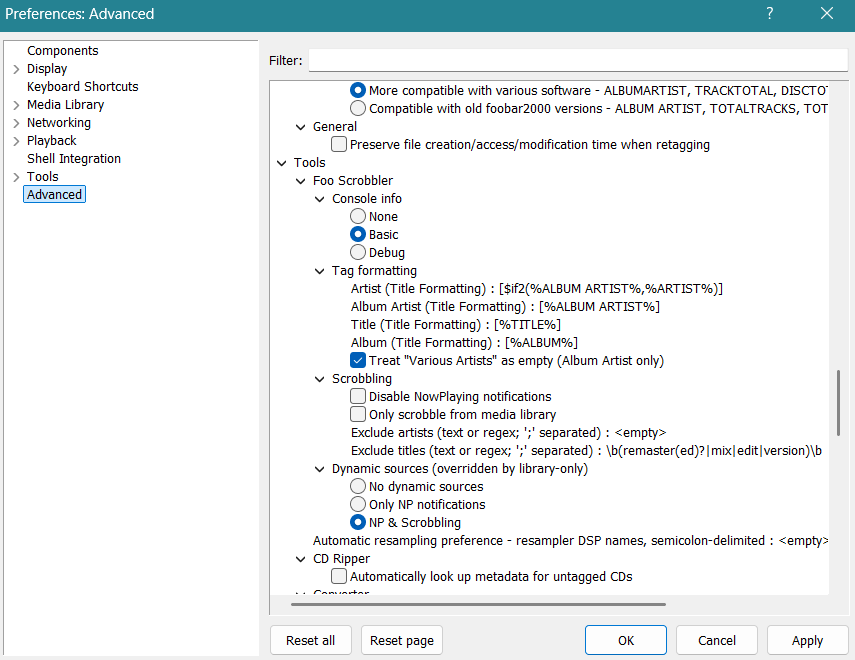

  <picture>
    <source media="(prefers-color-scheme: dark)" srcset="assets/foo-scrobbler_dark.svg">
    <source media="(prefers-color-scheme: light)" srcset="assets/foo-scrobbler_light.svg">
    
  </picture>

### Foo Scrobbler for Windows    

**Release:** 1.0.9  
**License:** MIT  
**Copyright:** © 2025–2026 Konstantinos Kyriakopoulos  

A native Lastfm scrobbler component (foo_scrobbler_win) for foobar2000 on Windows. It submits “Now Playing” and scrobbles using the official Last.fm Scrobbling 2.0 API, applies strict playback qualification rules, and keeps a local queue when you’re offline. Once authenticated, it runs quietly in the background.

**OS support:** Windows 10 (x86, x64) and Windows 11 (x64, arm64ec) for foobar2000 ≥ v2.24

This is the GitHub site of the [Windows version](https://github.com/zfoxer/foo_scrobbler_win).  
For the macOS version of Foo Scrobbler [see here](https://github.com/zfoxer/foo_scrobbler_mac).

### Quick start

1. In foobar, go to **Preferences → Components**.
2. Install: **foo_scrobbler_win.fb2k-component**.
3. [Authenticate](https://github.com/zfoxer/foo_scrobbler_win/wiki/LFM_Auth) once with your Lastfm account through the browse flow.  
4. Play music. Scrobbling happens automatically.

### Where the UI lives
- Main menu: **Playback → Last.fm**
- Settings: **File → Preferences → Advanced → Tools → Foo Scrobbler**

### What it does

#### Submission behavior
- Sends **Now Playing** when appropriate (aligned with Last.fm Scrobbling 2.0 expectations).
- Scrobbles only after playback qualifies (e.g., **50% played** or **240 seconds**, whichever comes first).
- Uses validation to prevent malformed or duplicate submissions.

#### When the network is unreliable
- If Last.fm can’t be reached, scrobbles are **queued locally**.
- When connectivity returns, the queue is **flushed automatically**.

### Design goals

- **Native component**: Runs inside foobar2000 on Windows, no wrappers.
- **Predictable rules**: Deterministic scrobble qualification.
- **Low overhead**: Lean implementation with no third-party dependencies.
- **Correct metadata handling**: Preserves tag values and processes them without alteration.

### Documentation

- Technical description: https://github.com/zfoxer/foo_scrobbler_mac/wiki  

  

### Licensing notes

The source code of this project is licensed under the MIT License.

The SDK is proprietary and is not covered by the MIT License. It remains the property of its original author (Peter Pawlowski / foobar2000).

The project logo and related visual brand assets are not covered by the MIT License and remain the intellectual property of Konstantinos Kyriakopoulos. All rights reserved.

### Release notes

<strong>Show changelog</strong>

<pre>
1.0.9    2026-03-26    Avoid reparsing the persisted scrobble queue on every access.
                       Cache compiled titleformat scripts instead of rebuilding them during playback.
                       Replace unsafe static locals in stream dedup with per-instance tracker state.
                       Last.fm back-end error 8 treated as temp, not having limited retries before discarding.
                       Fix regression for URL opener (only the Win version affected).

1.0.7    2026-03-20    Handle Last.fm rate-limit error 29 with queue cooldown.
                       Added MUSICBRAINZ_TRACKID in scrobbling and NP dispatch data.
                       Merged NP code into WebAPI.
                       Fix UI dynamic sources setting being disconnected.

1.0.6    2026-03-13    Added support for foobar Title Formatting for input tags. Removed previous tag mapping.
                       Added build for ARM64EC architecture for Windows 11.

1.0.5    2026-03-07    Added regular expressions (regex) support to filter out submissions (Advanced prefs).
                       Fixed: Unicode track titles are now handled correctly for Now Playing and scrobbling.
                       Switched to MIT License

1.0.2    2026-03-01    Initial Windows release. Sharing codebase with the macOS version.
</pre>

