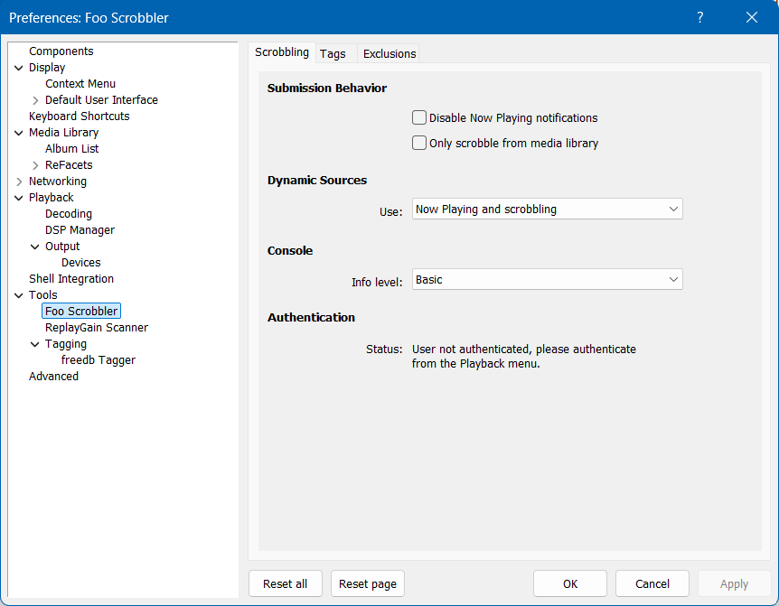

  <picture>
    <source media="(prefers-color-scheme: dark)" srcset="assets/foo-scrobbler_dark.svg">
    <source media="(prefers-color-scheme: light)" srcset="assets/foo-scrobbler_light.svg">
    
  </picture>

### Foo Scrobbler for Windows    

**Release:** 1.5.7  
**License:** MIT  
**Copyright:** © 2025–2026 Konstantinos Kyriakopoulos  

A native and original Last.fm scrobbler component (foo_scrobbler_win) for foobar2000 on Windows. It submits “Now Playing” and scrobbles using the official Last.fm Scrobbling 2.0 API, applies strict playback qualification rules, and keeps a local queue when you’re offline. Once authenticated, it runs quietly in the background.

**OS support:** Windows 10 (x86, x64) and Windows 11 (x64, arm64ec) for foobar2000 v2.24+

This is the GitHub site of the [Windows version](https://github.com/zfoxer/foo_scrobbler_win).  
For the native macOS version of Foo Scrobbler [see here](https://github.com/zfoxer/foo_scrobbler_mac).  
For the port of Foo Scrobbler to the **fooyin** player [see here](https://github.com/zfoxer/foo_scrobbler_yin).  

### Quick start

1. In foobar2000, go to **Preferences → Components**.
2. Install: **foo_scrobbler_win.fb2k-component**.
3. [Authenticate](https://github.com/zfoxer/foo_scrobbler_win/wiki/Authentication) once with your Lastfm account through the browse flow.  
4. Play music. Scrobbling happens automatically.

### Where the UI lives
- Main menu: **Playback → Last.fm**
- Settings: **File → Preferences → Tools → Foo Scrobbler**

### What it does

#### Submission behavior
- Sends **Now Playing** when appropriate (aligned with Last.fm Scrobbling 2.0 expectations).
- Scrobbles only after playback qualifies (e.g., **50% played** or **240 seconds**, whichever comes first).
- Uses validation to prevent malformed or duplicate submissions.

#### When the network is unreliable
- If Last.fm can’t be reached, scrobbles are **queued locally**.
- When connectivity returns, the queue is **flushed automatically**.

### Design goals and features

- **Native component**: Runs inside foobar2000 on Windows, no wrappers, not a port.  
- **Predictable rules**: Deterministic scrobble qualification.  
- **Offline caching**: Stores failed scrobbles and submits them later.  
- **Now Playing**: Handles Last.fm Now Playing updates correctly.  
- **One-time auth**: Requires authentication only once.  
- **Low overhead**: Lean implementation with no third-party dependencies.  
- **Playback validation**: Rejects malformed, invalid, or duplicate scrobbles.  
- **Dynamic sources**: Fully supports radio streams and dynamic playback metadata.  
- **Title Formatting**: Uses foobar2000 Title Formatting for input metadata.  
- **Regex filtering**: Filters unwanted scrobbles using regular expressions.  
- **Correct metadata handling**: Preserves valid tag values before submission.  
- **Console logging**: Fully reports impactful internal scrobbling actions.  
- **Open source**: Released under the MIT License.  

### Documentation

- Technical description: https://github.com/zfoxer/foo_scrobbler_mac/wiki  
- If you prefer to compile the plugin yourself, see the [Compilation Guide](https://github.com/zfoxer/foo_scrobbler_win/wiki/Compilation).  

  

### Release notes

<strong>Show changelog</strong>

<pre>
1.5.7    2026-08-04
Rework the logic behind the seekbar and scrobble eligibility.  
Pass musicbrainz_trackid through the TF pipeline.  

1.5.6    2026-07-21  
Fix handling of eligible pending stream scrobbles at shutdown.  

1.5.5    2026-07-14
Fix order of station title content parsing.  
Fix pause state from vetoing an eligible scrobble at track boundaries.  
Refresh FOO_SCROBBLER tag state on edits instead of polling every tick.  
Add option to hide the Playback Last.fm menu.  
Run Last.fm authentication off the main thread.  

1.5.4    2026-06-30
Apply Title Formatting scripts to streams like local files.  
Keep short CJK stream titles from being filtered as station noise.  

1.5.3    2026-06-21
Defer filtered dynamic tracks like local files.
Further separate dynamic and local tracker paths.  
Move shared tracker helpers into utilities.

1.5.2    2026-06-12
Extend validation for VA field values.
Defer tracks not in the library instead of rejecting them immediately.
Fix UTF-8 handling in station title heuristic.
Make exclusion substring matching Unicode-aware.

1.5.1    2026-06-06    
Replace the Advanced settings area with a tabbed pane under Preferences → Tools → Foo Scrobbler.  
Add four Title Formatting exclusion filter templates.  
Fix Now Playing notifications being sent when scrobbling was resumed while playback was paused.  
Clean up small repeated snippets of code related to retry behavior and scrobbling.  
Hold filtered tracks until they become eligible instead of dropping them immediately.  
Improve track metadata handling for local files and dynamic streams.  

1.1.2    2026-05-21    
Refresh edited playback metadata through the same filters before NP or queue updates for consistency.  
Fix Last.fm error 9 re-auth console spam.  

1.1.1    2026-05-11    
Preserve order of TF input and TF exclusion filters.  
Improve batch scrobbling error logs.  
Use backed-off, not-due scrobbles, to fill batches for small queues.  

1.1.0    2026-05-09    
Update queue draining with API-supported batch scrobbling.  
Fix rare worker races that could cause busy spins and stale queue retries.  
Add exclusion filtering using foobar2000 Title Formatting.  
Add regex filtering support for albums.  
Ignore scrobbling and Now Playing according to the FOO_SCROBBLER tag flag.  
Replace Windows BCrypt MD5 hashing with the SDK-native implementation.  

1.0.9    2026-03-26    
Avoid reparsing the persisted scrobble queue on every access.  
Cache compiled titleformat scripts instead of rebuilding them during playback.  
Replace unsafe static locals in stream dedup with per-instance tracker state.  
Last.fm back-end error 8 treated as temp, not having limited retries before discarding.  
Fix regression for URL opener (Windows-only).  

1.0.7    2026-03-20    
Handle Last.fm rate-limit error 29 with queue cooldown.  
Added MUSICBRAINZ_TRACKID in scrobbling and NP dispatch data.  
Merged NP code into WebAPI.  
Fix UI dynamic sources setting being disconnected (Windows-only).  

1.0.6    2026-03-13    
Added support for foobar Title Formatting for input tags. Removed previous tag mapping.  
Added build for ARM64EC architecture for Windows 11.  

1.0.5    2026-03-07    
Added regular expressions (regex) support to filter out submissions (Advanced prefs).  
Fixed: Unicode track titles are now handled correctly for Now Playing and scrobbling.  
Switched to MIT License.  

1.0.2    2026-03-01    
Initial Windows release. Sharing codebase with the macOS version.  
</pre>

